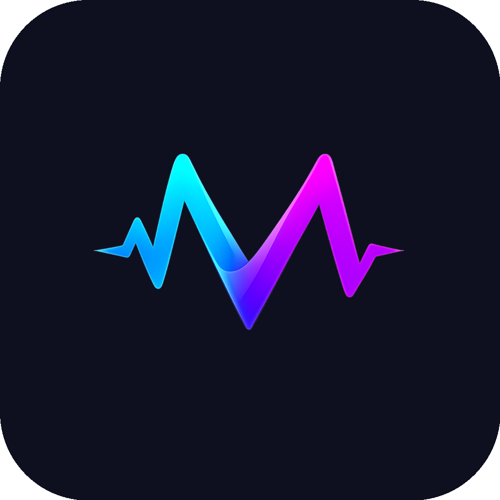
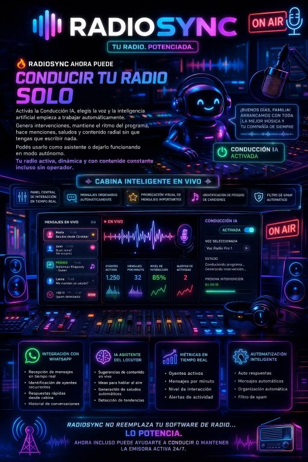

<p align="center">
  
</p>

<h1 align="center">Maxim Broadcast</h1>

<p align="center">
  <strong>Fork profesional de OBS Studio con panel web, IA y automatizacion para broadcast 24/7</strong>
</p>

<p align="center">
  
  <a href="https://github.com/luisitoys12/maxim-broadcast/releases/latest">
    
  </a>
  <a href="https://github.com/luisitoys12/maxim-broadcast/releases/latest">
    
  </a>
  <a href="https://github.com/luisitoys12/maxim-broadcast/blob/master/COPYING">
    
  </a>
  <a href="https://github.com/luisitoys12/maxim-broadcast/actions/workflows/ci.yml">
    
  </a>
</p>

<p align="center">
  <a href="#-que-es">¿Qué es?</a> •
  <a href="#-descargas">Descargas</a> •
  <a href="#-caracteristicas">Caracteristicas</a> •
  <a href="#-arquitectura">Arquitectura</a> •
  <a href="#-compilar">Compilar</a> •
  <a href="#-roadmap">Roadmap</a>
</p>

---

## ¿Qué es?

**Maxim Broadcast es un fork de OBS Studio** que extiende el motor de captura y streaming de OBS con:

- Un **panel web** accesible desde cualquier navegador o dispositivo
- Un **backend Node.js** que expone la funcionalidad de libobs via API REST y WebSocket
- **IA integrada** para subtítulos, auto-framing, chroma key y generación de gráficos
- **Playout 24/7** para operar canales de TV automatizados
- **Lower thirds, templates y editor dual** sin salir del navegador

A diferencia de OBS Studio (interfaz Qt local), Maxim Broadcast se controla completamente vía web — ideal para estudios remotos, canales de radio/TV y productoras que necesitan acceso desde múltiples dispositivos.

El **core de captura, encoding y streaming sigue siendo libobs** (el mismo motor de OBS). Lo que Maxim agrega es la capa de control web, automatización e IA encima.

---

## Descargas

### v1.2.0 — Estable

> **Requisito:** [Node.js 18+](https://nodejs.org) instalado en el sistema.

| Plataforma | Archivo | Instrucciones |
|:----------:|---------|--------------|
| **Windows 64-bit** | [`maxim-broadcast-v1.2.0-windows-x64.zip`](https://github.com/luisitoys12/maxim-broadcast/releases/download/v1.2.0/maxim-broadcast-v1.2.0-windows-x64.zip) | Extrae → doble clic en `INICIAR.bat` |
| **Ubuntu / Debian** | [`maxim-broadcast-v1.2.0-linux-amd64.deb`](https://github.com/luisitoys12/maxim-broadcast/releases/download/v1.2.0/maxim-broadcast-v1.2.0-linux-amd64.deb) | `sudo dpkg -i *.deb` → `maxim-broadcast` |
| **Linux (tar.gz)** | [`maxim-broadcast-v1.2.0-linux-x64.tar.gz`](https://github.com/luisitoys12/maxim-broadcast/releases/download/v1.2.0/maxim-broadcast-v1.2.0-linux-x64.tar.gz) | `tar -xzf *.tar.gz && ./start.sh` |
| **macOS 11+** | [`maxim-broadcast-v1.2.0-macos.zip`](https://github.com/luisitoys12/maxim-broadcast/releases/download/v1.2.0/maxim-broadcast-v1.2.0-macos.zip) | Extrae → doble clic en `Iniciar Maxim Broadcast.command` |
| **Docker** | `docker run -p 4000:4000 luisitoys12/maxim-broadcast` | Panel en http://localhost:4000 |

> Checksums SHA-256 en [`SHA256SUMS.txt`](https://github.com/luisitoys12/maxim-broadcast/releases/download/v1.2.0/SHA256SUMS.txt)

### Compilar con soporte nativo de OBS (captura real)

Para captura de video/audio real necesitas compilar desde código fuente con libobs:

```bash
git clone --recursive https://github.com/luisitoys12/maxim-broadcast.git
cd maxim-broadcast
# Ver BUILD_INSTRUCTIONS.md para instrucciones completas por plataforma
```

---

## Caracteristicas

### Motor OBS (libobs) — Core nativo

| Componente | Descripcion |
|-----------|------------|
| **libobs** | Motor de captura, composicion y encoding heredado de OBS Studio 30.x |
| **Plugins de captura** | Win Capture, DirectShow, V4L2, PipeWire, CoreAudio, AJA, DeckLink |
| **Encoders** | x264, NVENC (NVIDIA), QSV (Intel), AMF (AMD), Apple VideoToolbox |
| **Outputs** | RTMP, SRT, HLS, NDI, grabacion local MP4/MKV/MOV |
| **Filtros** | Chroma key, LUT, noise gate, compresor, EQ, VST, delay |
| **Servicios** | Twitch, YouTube, Facebook Live, RTMP custom, SRT custom |

### Panel Web (capa Maxim)

| Funcion | Estado |
|---------|:------:|
| Dashboard con stats en tiempo real (FPS, bitrate, CPU, frames) | ✅ |
| Gestion de escenas — crear, activar, eliminar | ✅ |
| Gestion de fuentes por escena | ✅ |
| Perfiles de streaming RTMP configurable | ✅ |
| Biblioteca de medios con upload (video/audio/imagen) | ✅ |
| Playout 24/7 — programacion con horario y repeticion | ✅ |
| Autenticacion JWT — registro, login, roles | ✅ |
| WebSocket — actualizacion en tiempo real sin recargar | ✅ |
| Lower Thirds y graficos dinamicos | 🔄 En desarrollo |
| Templates de produccion (noticias, deportes, entretenimiento) | 🔄 En desarrollo |
| Editor de video dual (live + pregrabado simultaneo) | 🔄 En desarrollo |
| Llamadas VoIP integradas (SIP/WebRTC) | 🔄 En desarrollo |
| Multi-streaming simultaneo (5+ plataformas) | 📋 Planeado |
| IA: subtitulos, auto-framing, chroma key inteligente | 📋 Planeado |
| Colaboracion multi-usuario en tiempo real | 📋 Planeado |

---

## RadioSync — Cabina Inteligente con IA

<p align="center">
  
</p>

**RadioSync** es el módulo de radio inteligente integrado en Maxim Broadcast. Convierte tu emisora en una cabina automatizada con IA.

### Funciones principales

| Módulo | Descripción |
|--------|------------|
| **Cabina en Vivo** | Panel central con mensajes ordenados por prioridad, identificación de pedidos de canciones y filtro de spam automático |
| **Conducción IA** | La IA conduce la radio sola — genera intervenciones, mantiene el ritmo, saludos y menciones sin operador |
| **Integración WhatsApp** | Recepción de mensajes en tiempo real, identificación de oyentes recurrentes, respuestas rápidas |
| **IA Asistente** | Sugerencias de contenido, ideas para hablar al aire, detección de tendencias |
| **Métricas en Tiempo Real** | Oyentes activos, mensajes/minuto, nivel de interacción, alertas de actividad |
| **Automatización** | Auto respuestas, mensajes automáticos, organización y filtro de spam |

> **RadioSync no reemplaza tu software de radio… lo potencia.**
> Ahora incluso puede conducir o mantener la emisora activa 24/7.

### Planes y Licencias

| | **Free** | **Premium** |
|:--|:--------:|:-----------:|
| Boletín de noticias IA | ✅ Gratis | ✅ |
| Voces IA (Microsoft TTS) | ✅ Gratis | ✅ |
| Cabina inteligente en vivo | ✅ Gratis | ✅ |
| Filtro de spam + auto-organización | ✅ Gratis | ✅ |
| Métricas en tiempo real | ✅ Gratis | ✅ |
| Conducción IA autónoma | — | ✅ |
| Clonación de voz personalizada | — | ✅ |
| Integración WhatsApp | — | ✅ |
| RadioClip (contenido para redes) | — | ✅ Incluido en Abril |
| **Licencia** | Gratis | **Vitalicia · Multidispositivos** |
| **Precio** | $0 | Consultar |

> **Pagos vía offline** — transferencia, depósito o el método que prefieras.

**Pide tu licencia:** WhatsApp [+598 91 782 920](https://wa.me/59891782920)

---

### Compatibilidad con OBS

Maxim Broadcast mantiene **compatibilidad directa** con el ecosistema OBS:

- Importa perfiles y colecciones de escenas de OBS Studio
- Compatible con todos los plugins de OBS (.dll / .so / .dylib)
- Mismos codecs y servicios de streaming
- Transiciones personalizadas de OBS funcionan sin cambios

---

## Arquitectura

```
┌─────────────────────────────────────────────┐
│           PANEL WEB (React + Vite)          │
│  Dashboard · Escenas · Streaming · Playout  │
└─────────────────┬───────────────────────────┘
                  │ HTTP REST + WebSocket
┌─────────────────▼───────────────────────────┐
│         BACKEND (Node.js / Express)         │
│   Auth JWT · API · Socket.io · Multer      │
└─────────────────┬───────────────────────────┘
                  │ N-API / node-ffi (en desarrollo)
┌─────────────────▼───────────────────────────┐
│              libobs (C/C++)                 │
│   Captura · Composicion · Encoding         │
│   Streaming · Grabacion · Plugins          │
└─────────────────────────────────────────────┘
```

**Stack tecnologico:**

- **Core:** libobs (fork de OBS Studio 30.x), FFmpeg, x264, NVENC
- **Backend:** Node.js 20, Express, Socket.io, Multer, JWT
- **Frontend:** React 18, Vite 4, Tailwind CSS, Zustand
- **Plugins:** C/C++ — mismos que OBS Studio
- **Deploy:** Docker, docker-compose

---

## Compilar

> Para el panel web no necesitas compilar — descarga el paquete de Releases.
> Compilar desde fuente solo es necesario para habilitar la captura nativa de OBS.

### Linux (Ubuntu 22.04+)

```bash
# Dependencias
sudo apt-get install -y cmake ninja-build pkg-config \
  libavcodec-dev libavdevice-dev libavformat-dev libavutil-dev \
  libswresample-dev libswscale-dev libx264-dev \
  libmbedtls-dev libgl1-mesa-dev libjansson-dev \
  libluajit-5.1-dev python3-dev \
  libx11-dev libxcb-randr0-dev libxcb-shm0-dev \
  qt6-base-dev libpipewire-0.3-dev nodejs npm

# Clonar con submodulos
git clone --recursive https://github.com/luisitoys12/maxim-broadcast.git
cd maxim-broadcast

# Compilar OBS core
cmake --preset linux-x86_64 -DCMAKE_BUILD_TYPE=Release
cmake --build build --parallel

# Iniciar backend + frontend
cd backend && npm install && node src/index.js
```

### Windows

```bash
# Requisitos: Visual Studio 2022, CMake, Qt 6, Node.js 18+
cmake --preset windows-x64 -DCMAKE_BUILD_TYPE=Release
cmake --build build --config Release

cd backend && npm install && node src/index.js
```

### macOS

```bash
brew install cmake ninja qt@6 swig mbedtls node
cmake --preset macos-arm64 -DCMAKE_BUILD_TYPE=Release
cmake --build build --parallel

cd backend && npm install && node src/index.js
```

Ver [BUILD_INSTRUCTIONS.md](./BUILD_INSTRUCTIONS.md) para guía completa.

---

## Roadmap

### Completado

- [x] **Fase 1–7 (v1.0.0):** Panel web, escenas, streaming RTMP, biblioteca de medios, playout, auth JWT, WebSocket stats
- [x] **v1.1.0:** Icono oficial, GitHub Actions (CI/Release/Docker), Dockerfile
- [x] **v1.2.0:** Paquetes descargables Windows/Linux/macOS, README completo

### En Desarrollo (Q1 2027)

- [ ] **Fase 8:** Playout 24/7 avanzado + Llamadas VoIP (SIP/WebRTC) — [Planificacion](./docs/roadmap/fase-08-playout-voip.md)
- [ ] **Fase 9:** Colaboracion multi-usuario y Cloud Sync — [Planificacion](./docs/roadmap/fase-09-colaboracion-cloud.md)
- [ ] Bindings N-API para control directo de libobs desde Node.js

### Planeado (Q2 2027)

- [ ] **Fase 10:** Multi-streaming simultaneo y monetizacion — [Planificacion](./docs/roadmap/fase-10-monetizacion-multistreaming.md)
- [ ] **Fase 11:** 4K/8K, AR, Virtual Sets, IA Director — [Planificacion](./docs/roadmap/fase-11-4k-ar-virtual-sets.md)

Ver [indice completo del roadmap](./docs/roadmap/README.md).

---

## Contribuir

Contribuciones bienvenidas. Proyecto de codigo abierto bajo GPL v2.0.

```bash
# Fork → clone → rama
git checkout -b feature/mi-funcion

# Commit y PR
git commit -m "feat: descripcion de la funcion"
git push origin feature/mi-funcion
```

---

## Creditos

**Basado en OBS Studio**
- Proyecto original: [obsproject/obs-studio](https://github.com/obsproject/obs-studio)
- Licencia original: GNU GPL v2.0

**Maxim Broadcast**
- Desarrollado por: EstacionKusMedia
- Mantenedor: [@luisitoys12](https://github.com/luisitoys12)
- Licencia: GNU GPL v2.0

---

<p align="center">
  <em>Maxim Broadcast — Fork de OBS para broadcast profesional accesible desde cualquier lugar</em><br>
  <em>Desarrollado con pasion desde Irapuato, Guanajuato, Mexico</em>
</p>
